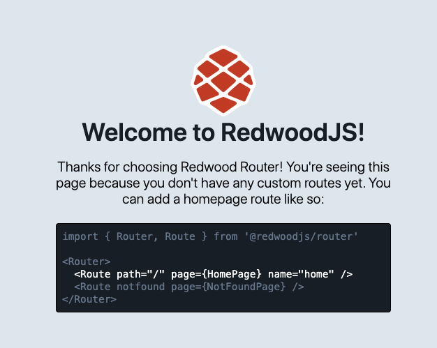
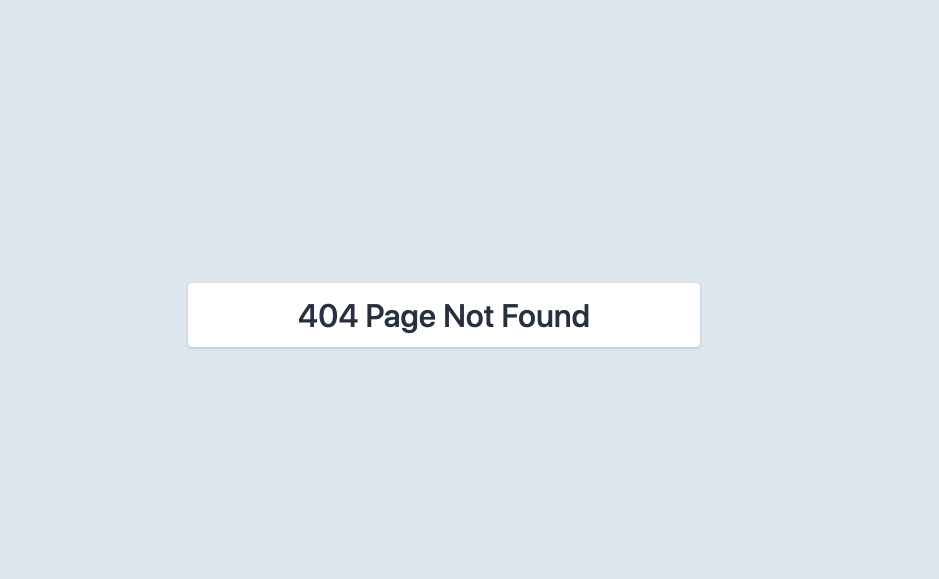

# RedwoodJS Page Redesign


## Some general considerations

Before interacting with the Redwood community, please read and understand our [Code of Conduct](https://github.com/redwoodjs/redwood/blob/main/CODE_OF_CONDUCT.md).

* All markup and styles need to be within the component
* Shouldn’t rely on TailwindCss
* Supports Safari, Chrome, Firefox, etc.
* Quick to load, so relatively lightweight
* Friendly, engaging, exciting
* No copyrighted materials
* Reflects mission and sentiment from [Docs - Introduction : RedwoodJS Docs](https://redwoodjs.com/docs/introduction)


Open to new animation, mascot/characters, helpful links to resources … be creative!

## How to Contribute

* Fork this repo
* Copy the `example` directory in `submissions`
* Rename this `example` directory to contain your `github` username (or some other way to identify you)
* Within this directory is where you can contribute screenshots and components for each page to review.
* Use the `README.md` to tell us more about your redesign concept and thoughts.
* Submit a PR with a short message and introduction
* We will review, comment and merge in after a basic check (just in the event there are inappropriate submissions)
* Once merged the RedwoodJS community can review and decide which pages get to be part of teh framework for v1.0! (Date TBD)

### Directory Structure

Copy the `submissions/example` directory:

```terminal
example
├── error
│   ├── README.md
│   ├── components
│   └── screenshots
├── not_found
│   ├── README.md
│   ├── components
│   └── screenshots
└── splash
    ├── README.md
    ├── components
    └── screenshots
```

and add a PR with your submission in `submissions/your-github-username`:

```terminal
- <github-username>
├── error
│   ├── README.md
│   ├── components
│   └── screenshots
├── not_found
│   ├── README.md
│   ├── components
│   └── screenshots
└── splash
    ├── README.md
    ├── components
    └── screenshots
```

In each `README.md` take some time to tell us about your design adn what makes it awesome.

## Splash Page

### Community Writeup and Comments
https://community.redwoodjs.com/t/give-the-redwoodjs-splashpage-more-splash/2051

### Current Page


## Not Found Page

### Community Writeup and Comments

> Find time to redesign the RedwoodJS 404 Not Found page

https://community.redwoodjs.com/t/find-time-to-redesign-redwoodjss-404-not-found-page/2052

### Current Page



## Error Page


### Community Writeup and Comments

> Hey, wha happened? Let's redesign Redwood's Error Page

https://community.redwoodjs.com/t/hey-wha-happened-lets-redesign-redwoods-error-page/2053


### Current Page


